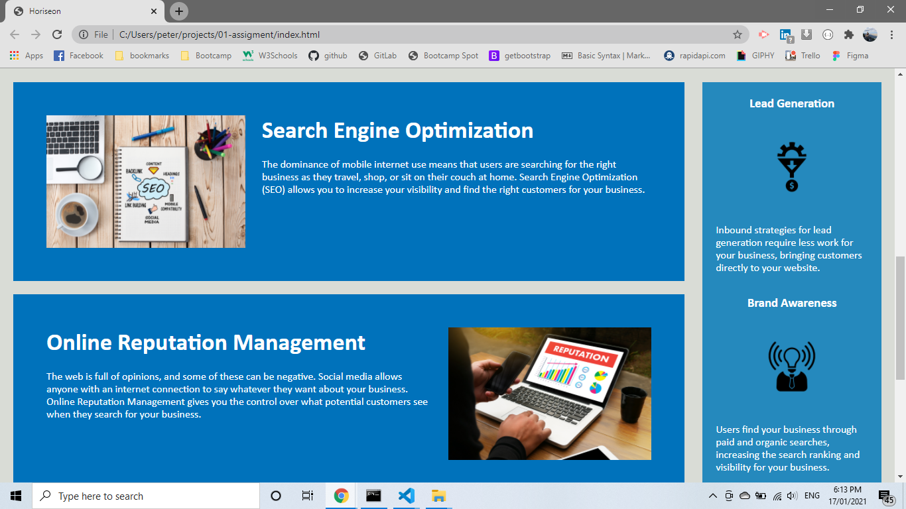
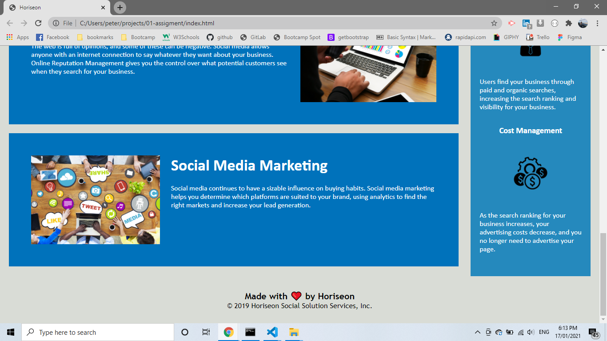
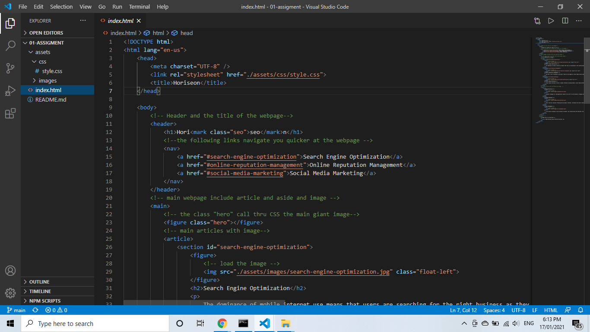
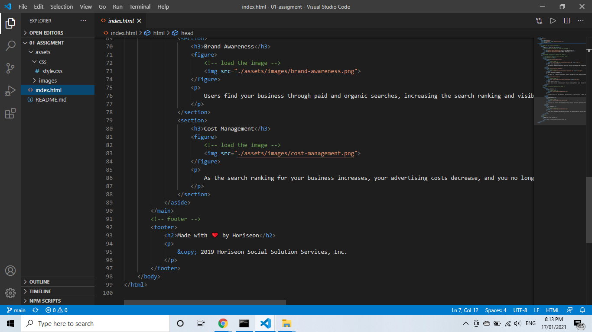
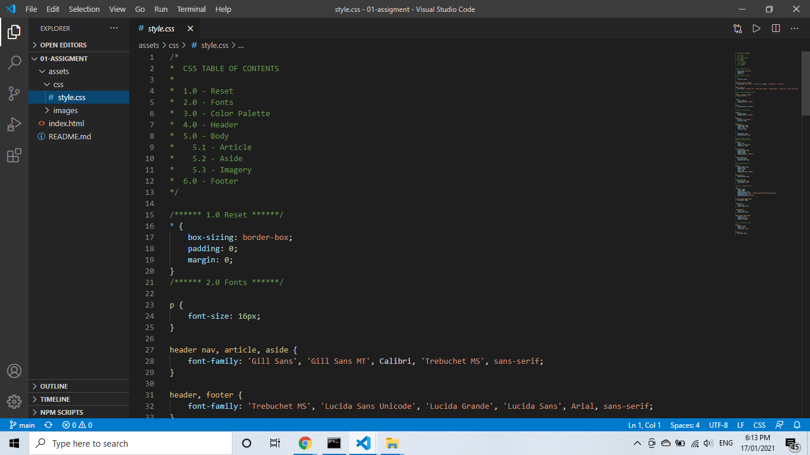
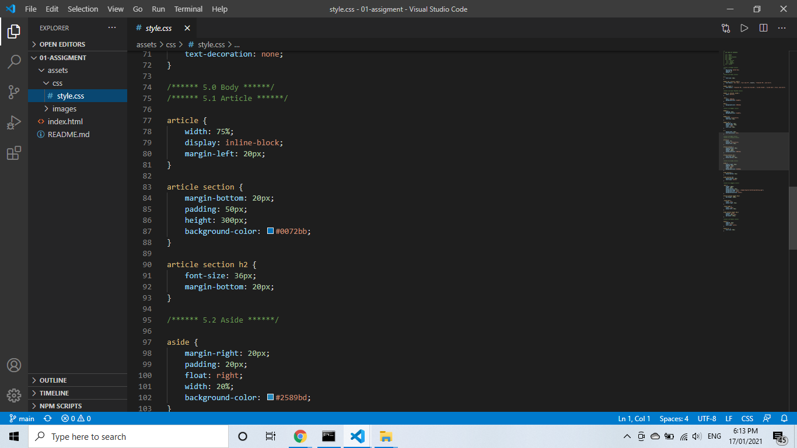

# Code Refactor

link of repository :   https://github.com/pfotis/code-refactor

link of webpage    :   https://pfotis.github.io/code-refactor/

This is the my first assigment in the full stack web developer bootcamp. The steps are to keep the same functionality of the web page , additional to clean the code and to use semantic HTML tags and to add comments html and css file.

## Webpage

The following sreenshots are what the user can see when visit this webpage.  

## HTML and CSS

The Following screenshots are what the user can't see with the first look but a full stack web developer could read and 
understand . The comments could hepl the full stack web developer to understand quicker .

